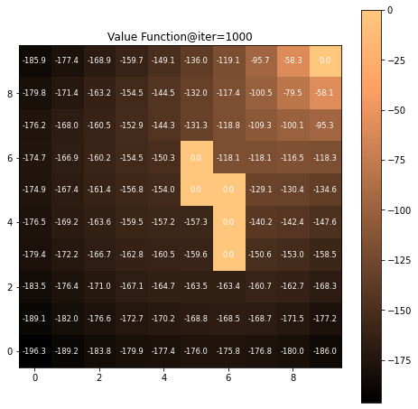
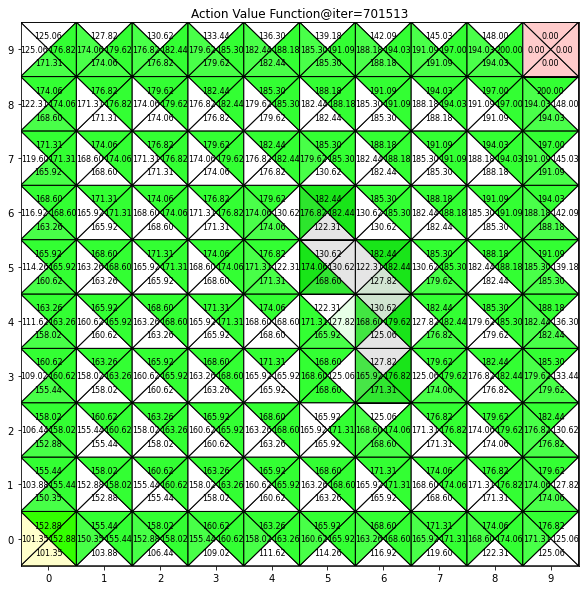
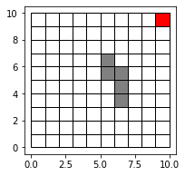

Reinforcement Learning Basics
==============

This is for basic reinforcement learning: algorithms and main equations for dynamic programming (DP), monte carlo method (MC), and temporal difference (TD).

Details
-----

### 0. Grid Environments

* 5x5 grid env. (grid_env_55.ipynb)   
    * Fast convergence, **recommended!!!**
* 10X10 grid env. (grid_env.ipynb)   
    * Slow convergence   

### 1. Dynamic Programming (DP)

* There are two version DP: state value based and action value based
* Policy evaluation, policy improvent
* Policy iteration
* Value iteration

### 2. Monte Carlo Method (MC)

* On-policy first visit MC
* Off-policy first visit MC

### 3. Temporal Difference (TD)

* SARSA, Q-learning, Expected SARSA, Double Q-learning

Visualization Examples
-----

### Value Functions (State value $V(s)$, Action value $Q(s,a)$)

    
    

### 10x10 Grid Environment
